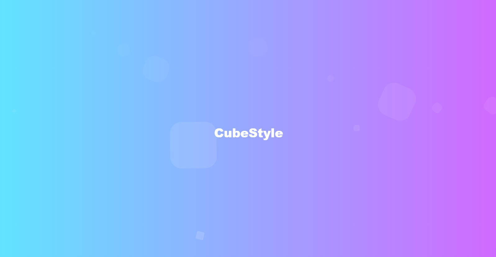

<!-- Projeto Finalizado -->
# 🧊 Cubes Background

<p align="center">
  <!-- Contador de linguagens do GitHub -->
  
  <!-- Tamanho do repositório no GitHub -->
  
  <!-- Licença do GitHub -->
  
</p>

<div align="center">
  
</div>

## 🌀 Descrição do Projeto

Este projeto utiliza animações em CSS para criar uma série de cubos animados com efeitos visuais dinâmicos em uma página web. A técnica empregada transforma e movimenta cubos para gerar um fundo animado e visualmente interessante.

## 🔍 Visualize o Projeto

Confira o projeto online através deste [link](https://devandreotti.github.io/cubes-background/).

## 🛠 Tecnologias Empregadas

- **HTML5**: Estrutura da página.
- **CSS3**: Estilos e animações dos cubos.

## 🧭 Como Executar

1. **Clone o repositório**
   ```bash
   git clone https://github.com/seu-usuario/cube-style.git
   ```

2. **Abra o arquivo `index.html` no navegador.**

## 💪 Contribuição

Contribuições são bem-vindas! Para colaborar, siga estas etapas:

1. Faça um fork do projeto.
2. Crie uma nova branch para sua feature: `git checkout -b feature/nome-feature`.
3. Commit suas mudanças: `git commit -m 'Adiciona nova feature'`.
4. Envie para a branch: `git push origin feature/nome-feature`.
5. Abra um Pull Request.

## 📝 Nota

Este projeto demonstra técnicas de animação em CSS. Sinta-se livre para explorar e adaptar conforme necessário.
