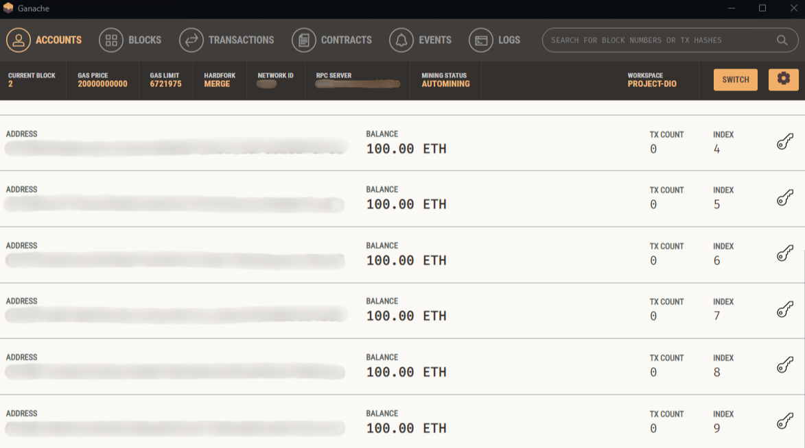

# Cubes Background

<div align="center">
  
</div>

## Descrição do Projeto

Projeto de animação em CSS que cria uma série de cubos animados com efeitos visuais dinâmicos em uma página web. Utiliza animações para transformar e movimentar cubos.

## Tecnologias Empregadas

- **HTML5**: Estrutura da página.
- **CSS3**: Estilos e animações dos cubos.

## Como Executar

1. Clone o repositório:
   ```bash
   git clone https://github.com/seu-usuario/cube-style.git
   ```
2. Abra o arquivo `index.html` no navegador.

## Estrutura do Projeto

- `index.html`: Contém a estrutura HTML da animação.
- `style.css`: Define os estilos e animações dos cubos.

## Contribuição

Contribuições são bem-vindas! Para contribuir, siga estas etapas:

1. Faça um fork do projeto.
2. Crie uma nova branch para sua feature `git checkout -b feature/nome-feature`.
3. Commit suas mudanças `git commit -m 'Adiciona nova feature'`.
4. Envie para a branch `git push origin feature/nome-feature`.
5. Abra um Pull Request.

## Nota

Este projeto demonstra técnicas de animação CSS. Sinta-se livre para explorar e adaptar conforme necessário.
